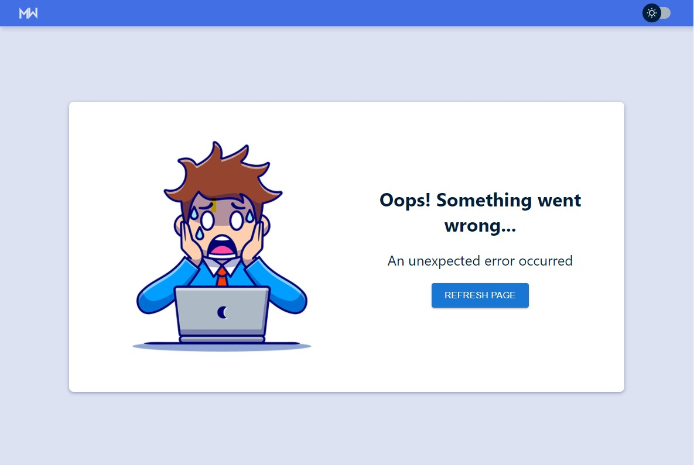

# Crypto Converter App

A simple app allowing you to convert selected cryptocurrencies to fiat currencies and vice versa. It also displays current data for listed cryptocurrencies.

## Table of contents
* [Motivation](#motivation)    
* [Demo](#demo)
* [Data](#data)
* [Technologies](#technologies)
* [Sources](#sources)
* [Future plans](#future)

<a id="motivation"></a>
## 🤓 Motivation

I recently got interested in crypto markets and wanted to be able to convert prices to fiat currency in a simple and straighforward way. I also wanted to have a display of current prices and changes. As I was coding the app, every time I fetched data I found out the current prices which was an added bonus for me and made working on the app even more enjoyable. 

<a id="demo"></a>
## 👀Demo

[Try the demo!](https://crypto-converter-mw.netlify.app/)     
App provides a converter that works from and to cryptocurrencies. Each input has a select with currencies that updates the exchange rate.      
There is also a dashboard with current data. Option to toggle view between cards and a table. MUI Table offers built in filtering and sorting tool.     
User can switch between light and dark mode.     


In case of an error there is a custom error screen in both light and dark mode. 

<details>
  <summary>Here you can check error screen.</summary>
  <br>
  
</details>


<a id="installation"></a>
## 📥 Installation and running app

Fork and clone this repository.    
Use the npm package manager to install.

```bash
npm install
```

To start use a command

```bash
npm start
```
<a id="data"></a>
## 📊 Data 

To get data I used [Coin gecko API](https://www.coingecko.com/en/api/documentation) that provides exchange rates, as well as current and historic data. 

<a id="technologies"></a>
## 🛠 Technologies used

This project is written in React, using functional components. Folders are structured feature-first.

- Project starter 
  - [create-react-app](https://github.com/facebook/create-react-app)
- Code Quality tools 
  - Formatting - Prettier
  - Linting - ESLint
  - Type Checking - [Typescript](https://www.typescriptlang.org/)
- State management 
  - React context in combination with useReducer and custom actions
- Styling
  - [Styled components](https://styled-components.com/)
- UI Libraries 
  - [Material UI](https://mui.com/getting-started/usage/) for switch, inputs, selects, icons and table.
- Other libraries
  - [React number format](https://www.npmjs.com/package/react-number-format) was used to format numbers in inputs 
- Hosting
   - [Netlify](https://www.netlify.com/)   
   
<a id="sources"></a>
## 📚 Sources 
- For crypto icons I used [cryptologos](https://cryptologos.cc/)
- For country flags I used [circle flags](https://hatscripts.github.io/circle-flags/)
- Vector image for errorscreen is from [freepik by catalyststuff](https://www.freepik.com/catalyststuff)

<a id="future"></a>
## 🌅 Future plans

- User will be able to customize which cryptocurrencies and fiat currencies would be displayed to them. That would offer bigger selection to user.
- Displaying more detailed information about cryptocurrencies (24h high, 24h low, graph).


## 👾 Author 
This app was done by Marketa Willis. 
* [LinkedIn](https://www.linkedin.com/in/marketa-willis-2b322b173/)
* [Instagram](https://www.instagram.com/marky.programuje/)

